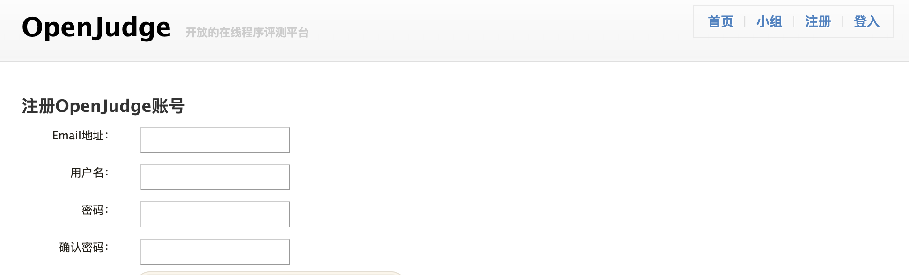
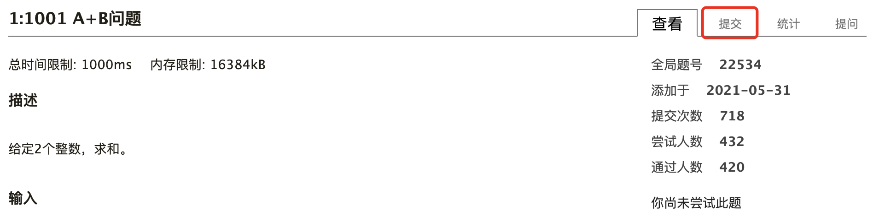
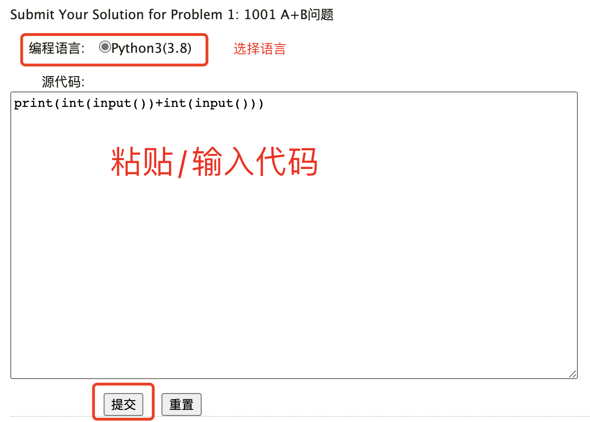
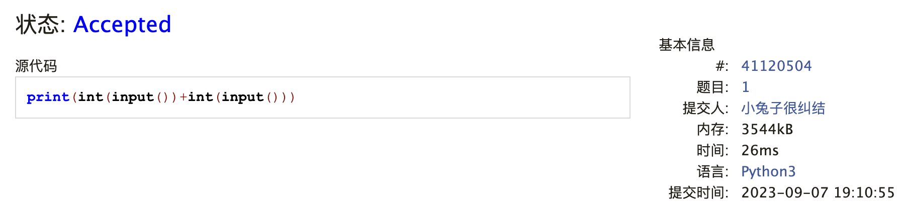

# OJ使用说明

## 登录

你需要登录才可以使用 Openjudge。点击页面右上方的"注册"按钮，输入邮箱等信息注册账号。

登录之后，前往[课程页面](https://programming.pku.edu.cn/course/0b0ead5e1550494cb060fca75d9e2604/)，点击加入小组，就可以看到作业了。

## 阅读题目并提交代码

点击对应的作业标题，就可以看到作业题目列表了。每次OJ作业都有截止期限，请同学们务必留意。

点开题目，即可阅读题目信息。点击右边的“提交”按钮来提交代码：

## 查看提交结果

提交之后，跳转的页面便会显示此次提交的结果。

一般地：
- `Accepted` 代表这段代码通过了网站的测试，认为是正确答案；
- `Wrong Answer` 代表这段代码在某次测试中给出了错误的响应，你可能需要更正；
- 其它可参考[提交结果说明](./submit_result)。
