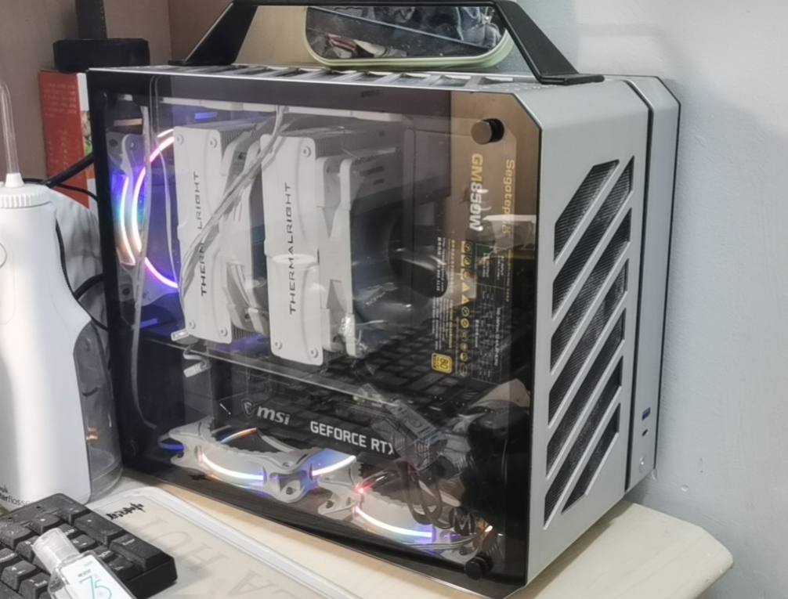
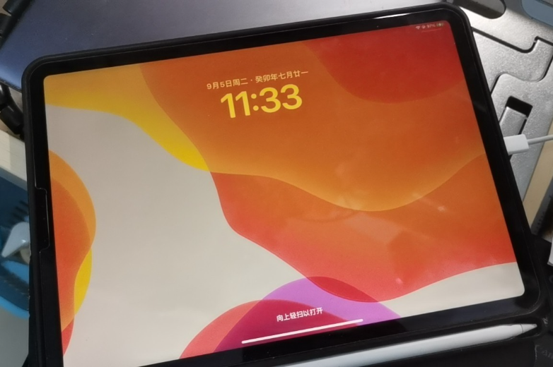
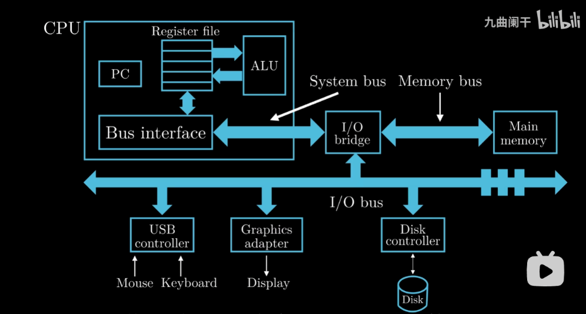
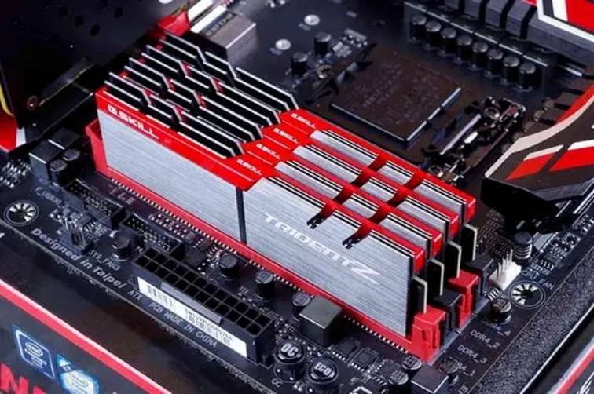
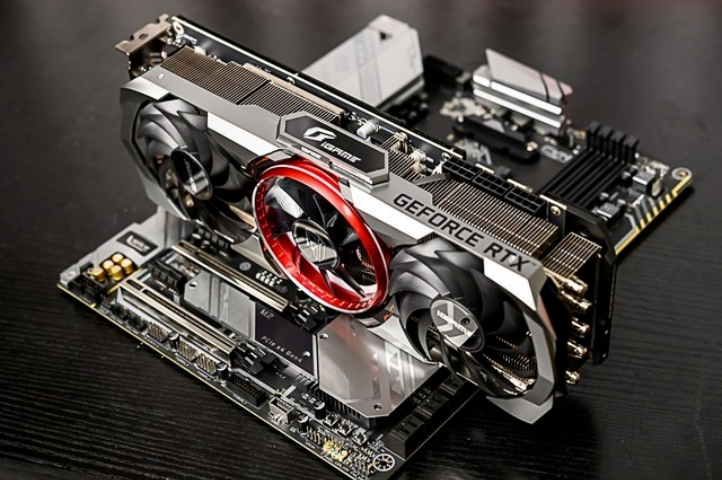
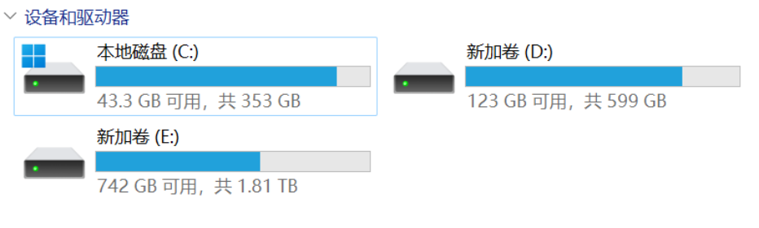
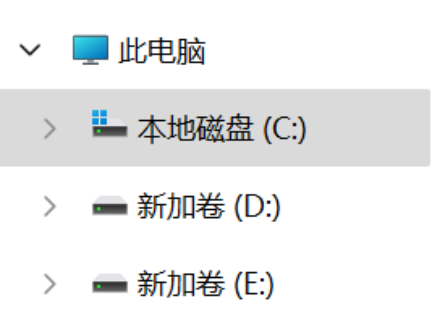
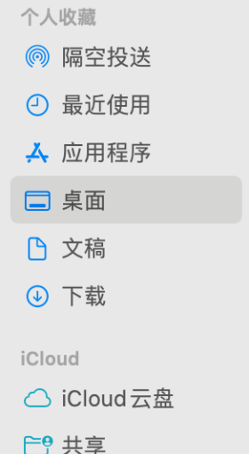
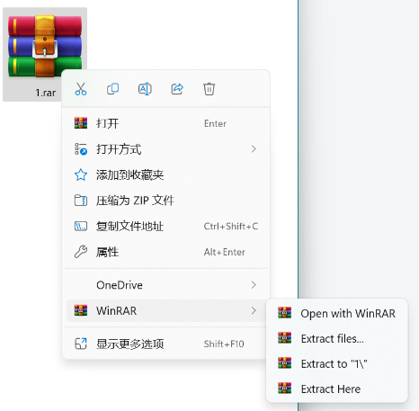

# 电脑基础扫盲帖

## 0. 前言

计算概论C是为文科和社科院系开设的计算机（编程）基础课。很多人可能会想：我是学文科的，以后又不会当程序员，学这个干什么？所以，作为这门课的助教，我希望你除了编程以外，学到一些更容易受益终身的东西：对于电脑的正确认识。

有些经常上网冲浪的同学们可能会听说，把所有东西放在C盘可能会被别人嘲笑，但又不知道为什么。有些同学在选购电子产品的时候，会分不清什么是内存，到底是16G的那个，还是512G的那个？还有些同学的电脑上会出现各种“管家”“助手”，导致电脑卡成PPT，但又不知道怎么避免这些东西。希望看完本篇帖子以后，大家对于以上的问题，都能迎刃而解。

——助教深海羽翼

## 1. 认识你的电脑

这里用我本人的一些设备，来展示一些我们日常能见到的计算机。

    
     
    
台式电脑（的机箱）

    
     
    
笔记本电脑

    
     
    
平板电脑

iPad等平板电脑和手机也是一种计算机，但不推荐用它们来学习计算概论这门课程，因为它们的系统都是高度封装过的，隐藏了很多东西。

### 硬件

#### 认清输入、输出设备和核心组成部分

现代人使用的计算机有如下的特点：

- 有输入设备（键盘、鼠标、触摸屏）；
- 有输出设备（显示器，音响设备，打印机等）；
- 有负责运算、储存的设备（台式机机箱、笔记本和手机壳子里面的一堆玩意儿）

认识计算机的第一步，就是分清楚它们。

#### 计算机的核心（分清存储空间和内存！）

输入输出设备，大家一直在打交道，就不展开叙述了。下面来看看最核心的部分：负责运算和储存的部分。

    
     

这张图展示了计算机的各个组成部分。看不懂里面的细节不要紧，只需要知道如下几点：

- 左上角那个大框是CPU（Central Processing Unit），中央处理器，顾名思义，负责处理计算机的所有运算。

    
     
    
电脑主板上的CPU

- 中间的I/O bridge，叫做“桥”，现实中在主板上一般分为两块：南桥和北桥。它可以当作数据线来看待，就只负责传输数据。中间那根横线I/O bus，叫做“总线”，也是传输数据用的。

    
     
    
主板上的北桥和南桥

- 右上角的Main Memory，就是我们常说的内存，负责暂时存储程序中的数据。这种存储介质称为Random Access Memory（意思是可以按照任意位置快速访问），简称**RAM**（会考！），**断电了就会丢数据**，所以说是暂时存放用的！

    
     
    
插在主板上的一条条的就是内存条

- TIPS：内存的大小影响运行大型程序的能力，如果你的内存太小，操作系统会经常使用硬盘上的交换空间，你可能就会变卡。我入学的时候（20年）买的笔记本内存8GB，现在看来有点弱了，笔记本几乎都是16GB起步，我目前的台式机是32GB，供你们设备更新换代的时候参考。
- 下面的一堆玩意（USB适配器，给你插U盘用的；显示适配器，也就是俗称的显卡，计算能力较强，一般用于渲染图形，打游戏的都懂；硬盘适配器，用于连接你的硬盘）都是外部设备。没错，显卡和硬盘也是外部设备！

    
     
    
芝士显卡

    
     
    
芝士 M.2 固态硬盘，速度很快

    
     
    
芝士古老的SATA口硬盘，速度比较慢

- TIPS：我们平常说的存储空间指的就是硬盘的空间，比如什么512GB，1TB，指的都是硬盘容量。

    
     
    
Windows可以在“系统信息”看到自身的内存大小，这里是32.0GB

    
     
    
这些是你电脑里的硬盘（虚拟硬盘）。

- 计算机的主板上还有一个特殊的小东西叫BIOS芯片。它是一种只读存储器（**ROM**，Read-Only Memory），顾名思义，不允许被修改。它里面是一段特殊的程序，叫BIOS，负责在开机的时候激活硬盘里的操作系统。

### 软件

软件，一般指的是被计算机执行的程序。

处于最底层的软件是操作系统。它承上启下，负责管理所有的硬件，同时管理所有用户的程序。（比如Office，python程序，游戏，浏览器等等）

对于计算概论C的同学，你们接触最多的应该是Windows和MacOS操作系统。这两种操作系统的底层接口不一样，所以这两个系统上的程序一般是不通用的。 ~~所以Mac有很多游戏玩不了，真不是游戏厂商故意卡脖子。~~

了解得多的同学可能听说过Linux或者Ubuntu之类的操作系统，这些主要给开发人员使用，大家听个名字就好了。

## 2. 认识电脑上的所有文件

### 系统&软件
#### Windows

    
     

还是这张图。你的所有硬盘会显示在“此电脑”里面。Windows里面，系统程序和你在网上下载的软件（Office，Photoshop，VSCode等等）默认放在C盘，所以请务必给它留足够的空间。

    
     
    
“此电脑”在文件资源管理器的左侧这个位置

**TIPS**：有人会建议把软件下在D盘。我不建议这样做，默认的路径永远是最保险的，否则遇到写的很烂的软件，说不定会遇到奇奇怪怪的问题。

    
     

一般来说你的程序会放在C盘的Program Files文件夹。尽量别动它就好。

#### MacOS
本节由小兔子猫图bot编写。

macOS 文件管理中心叫「访达」，类似于 Windows 上的「我的电脑」。

    
     

- 「隔空投送」用来向其他Apple设备发送/从其他Apple设备接收文件
- 「最近使用」听名字就知道是干什么的（x）
- 「应用程序」保存了你从App Store或者互联网上安装的各种软件（一般是*.app格式）
- 「桌面」和Windows差不多
- 「文稿」可以类比「我的文档」，有一堆软件的默认保存目录都在这里
- 「下载」一般保存了你从各种地方下载的东西，包括但不限于从QQ、浏览器等地方……

在你的mac上安装程序，可以使用App Store，或者有些软件App Store没有，或者App Store的版本非常烂/比官网直接买贵，就需要从网络上下载相应的安装包。一般来说，有两种安装方式，一种是自动安装，你只需要一路确认下去就行了；另一种是手动把软件图标拖到上面的「应用程序」文件夹。

推荐在自己的MacBook上面安装命令行程序[brew](https://brew.sh/)，用来安装一些可能用到的东西。

#### 关于体积单位
1比特bit指的是1个0或1的二进制位，1字节byte指的是8bit。之所以叫“字节”是因为这是一个英文字母所占的体积。

一般来说，Mb或者Gb这种小写b的代表bit，MB或者GB这种大写B的代表byte，二者差8倍。1KB是1024字节，1MB是1024KB大约是一百万字节，1GB是1024MB大约是十亿字节，1TB是1024GB大约是一万亿字节。

常用的是字节（大写的B）作为单位。

常见的一些大小数量级：
- 一个英文字母是1B
- 一个int（C++的标准整数类型）占4B
- 一张屏幕截图往往100KB~1MB不等
- 一张照片大约1MB~30MB不等，取决于压缩质量
- 一个手机APP大约1GB ~~（臃肿不堪，差评，以前的APP只有几十MB~~
- 电脑的内存一般8GB~32GB，有些富哥/姐的台式机会有64GB甚至更多
- 手机的存储空间大约128GB~1TB
- 电脑的存储空间大约512GB~4TB，一块硬盘差不多也是这个容量，台式机可能扩容很多块硬盘

#### 怎么下载软件
省流：去官网。

怎么找官网？百度直接搜名字，看看清楚哪个链接是官网，哪个是高仿。然后在官网找下载按钮。

下载得到的是一个安装包，点击打开它就可以安装，全部默认即可。

下载的文件不知道去哪里了？Windows的话，可以看看文件资源管理器左边的“下载”文件夹，或者浏览器右上角的下载内容。

    
     
    
如图，中间那个最大的按钮

#### 怎么压缩/解压文件夹

Windows自带一个zip解压缩工具，但只能解压zip格式，不太好使，我一般是用WinRAR，免费的，功能很充足，怎么安装见上文。

压缩文件一般长这样：

    
     

或者这样：

    
     

也有可能是.7z格式，或者其它杂七杂八的格式。

解压缩的时候对着图标点右键，然后

    
     

看你的需求，Extract到对应的地方。

把一个文件夹/一个文件/一堆文件变成压缩文件也是同理。

    
     

你可以用“压缩为ZIP文件”，也可以用WinRAR的“Add to XXX”，看你需求选择对应选项。选第一个的话，你还可以给它加密。

小兔子助教补充：也可以使用360压缩**国际版**，清爽无广告，好用。

### 你的资料
Windows的话，个人建议把它们放在C盘之外的某个盘，比如D盘，防止C盘爆满。

别把所有东西放桌面上！桌面其实是C盘里面的一个文件夹。东西都放在桌面上就相当于放在了C盘上面。

Mac的话，既然一共只有一个盘，那么你自己找个好位置放你的资料文件夹就行了。

### 认识快捷方式
有人可能会问：不是说别把所有东西放桌面上吗？为什么我的软件都在桌面上？

    
     
    
我超，O!

如图，桌面上一大堆图标。但是这些图标左下角都有个箭头符号，这代表它是一个快捷方式。
以谷歌浏览器为例，右键点击它，选择“属性”，可以看到，它真正的位置在这里：

    
     
    
目标：xxxxxxxx

所以其实它的本体不在桌面上，而是在C盘里的某个很难找的位置。快捷方式能够让你直达那个位置，打开那个程序。

**TIPS**：同理，你可以把你的个人资料文件夹也创建一个快捷方式，放在桌面上。这样你可以快速直达它。

## 3. 认识编程

## 4. 遇到问题如何求助
### 搜索引擎
如果你安装软件/配置环境/跑代码报错，请复制报错的信息，放到搜索引擎里面搜。

报错信息里面包含了很多有用的信息，你可以尝试自行阅读，读不懂的话就搜索。

ChatGPT也可以，前提是你能上的去。如果你能够不借助他人帮助独立上ChatGPT，那你的水平已经可以傲视这篇教程了。
### 助教

如果你的代码遇到了bug但是看不出来为什么，可以将代码发给助教，并且描述你的bug产生的全过程，越详细越好（比如输入是什么，输出应该是什么，但是输出了什么）。

可以在VSCode之类的代码编辑器里面**截图**发给助教，因为这样有代码高亮，容易阅读。

请牢记，**永远不要**把代码直接黏贴到微信里面发过来：首先，微信可能会把tab换成空格，造成代码变得错误；其次，一大坨文本在微信里就是一坨黑色的玩意，没有格式，没有高亮，换行错乱，完全无法阅读。

也可以但是最好不要直接发代码的.py文件，因为助教可能只有手机，看不了python代码文本。看截图永远是最方便的。 ~~实在懒得截图就拍屏吧~~

### 自己

老话说得好，求人不如求己。随着水平进步，你们可以尝试自行定位bug。你可以尝试打印一些中间步骤的结果，或者利用IDE的单步调试功能，逐步排查出错的地方在哪一块。

## 5. 一些其他的
想到哪写到哪～
- 为了你的学习资料和个人资料的安全性，建议你弄一个网盘，把自己的资料文件夹做一个云同步，这样你的资料会同步到网盘里面。甚至在你存储空间不足的时候，可以释放本地的空间。学校提供了OneDrive的使用权，但这个速度慢且不稳定，不推荐，具体选哪个网盘就见仁见智了，但数据安全很重要。
- 大型游戏（比如steam下载的游戏）建议不要放在C盘，因为实在太大了。你可以很方便的设置steam文件夹的位置。
- 给你的每个文件好好命名！不要用什么`1.doc`，`2.ppt`，别看一时爽，过了哪怕一天回来，你就会纳闷自己到底保存了个什么鬼玩意儿。如果是照片这种一堆一堆的，那就给文件夹命名。

    
     
    
我自己的整理风格：按照学期-课程给资料分类。这样永远不会担心什么东西找不到。

- 现代的Win11不需要任何杀毒软件！Windows有自带的病毒防护，那个就够用了。除非你自己无视警告，执意安装那种一看就是病毒的软件。  ~~让我访问！~~
- 同理，也不需要任何所谓“电脑管家”！如果想要卸载软件，可以在开始菜单搜索“添加或删除程序”。现在，和你的360说拜拜吧~
- 善用电脑上的截屏键：Windows系统，同时按Shift+Windows+S；或者用qq or 微信电脑版聊天框自带的截图工具。手机拍屏幕提问会给助教的视力造成**毁灭打击**。（除非你有把握拍的很清楚，几乎不带摩尔纹，但这一般不太可能
- 学会魔法：校友搭建了免费的魔法供北大师生使用：[wallesspku](wallesspku.space)
- 如果你想用电脑记笔记，建议使用 markdown，它很好学：[这里](https://markdownguide.org)。我平常用 vscode 编辑 markdown，你也可以用别的软件，比如 obsidian 或者 typora。如果你比较懒，这个在线编辑器也很好用：[这里](https://dillinger.io)。关于 vscode 的配置你可以参考[这里]( https://zhuanlan.zhihu.com/p/366596107)

